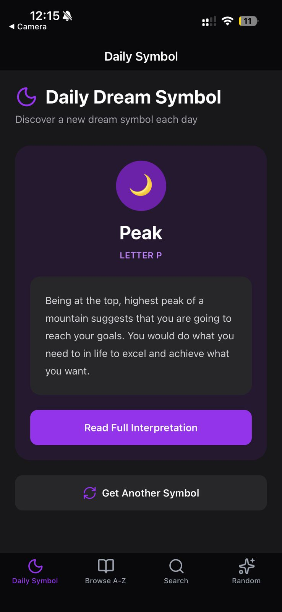
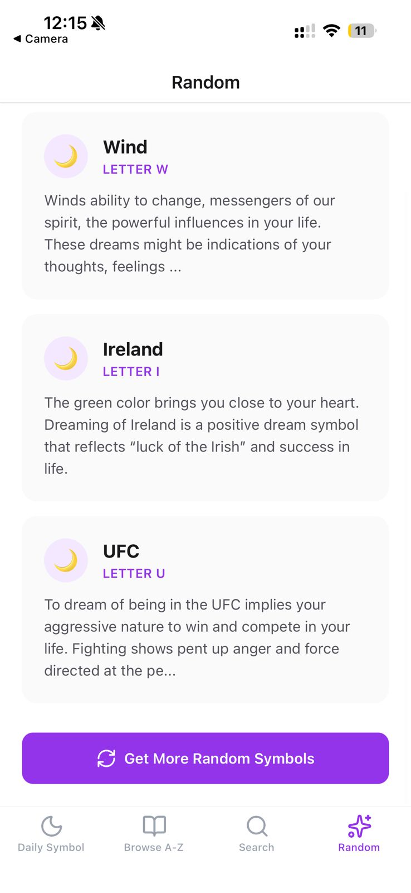
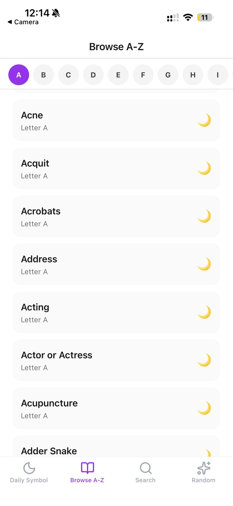
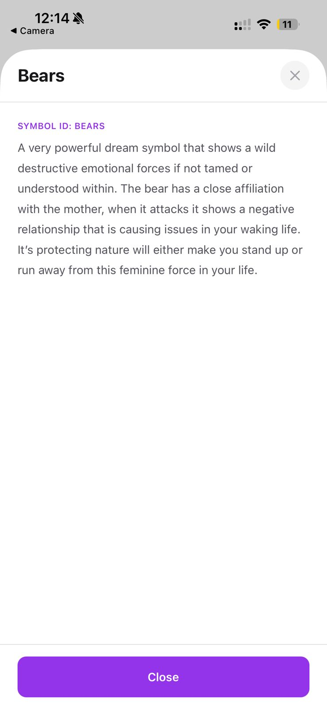
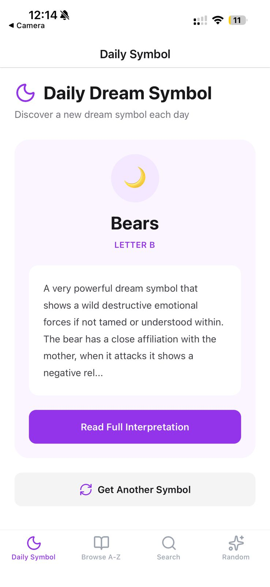

# RoxyAPI Dreams Starter - Dream Interpretation App

Build your own dream interpretation app with React Native and Expo. This production-ready starter connects to the RoxyAPI Dreams API to decode dream meanings, search 2,000+ dream symbols, and help users understand what their dreams mean. Perfect for creating dream dictionary apps, dream journal apps with symbol lookup, or dream meaning search tools.

## Screenshots

<p align="center">
  
  
  
  
</p>
<p align="center">
  
  
  
</p>

## What You Can Build

Create professional dream analysis apps with features users love:

- **Daily Dream Symbol**: Random dream symbol discovery - perfect for "dream of the day" features
- **A-Z Dream Dictionary**: Browse all dream symbols alphabetically - from abandonment dreams to zodiac dreams
- **Dream Symbol Search**: Search 2,000+ dream meanings by keyword - find what flying dreams mean, teeth falling out symbolism, snake dreams interpretation, water dreams, death dreams, and more
- **Random Dream Discovery**: Get multiple random symbols for meditation and dream exploration
- **Full Dream Interpretations**: Tap any symbol for complete psychological meanings covering subconscious symbolism, emotional significance, and connections to waking life
- **Dark Mode Support**: Beautiful purple dream theme with automatic dark mode
- **Type-Safe API**: Auto-generated TypeScript types from OpenAPI schema

## Perfect For Building

- Dream interpretation apps for iOS and Android
- Dream dictionary and symbol lookup tools  
- Dream journal apps with meaning search
- Dream meaning websites and mobile apps
- Meditation and spiritual wellness apps
- Psychology and self-discovery tools

## Tech Stack

Modern, production-ready technologies:

- **Expo SDK 54** - React Native development platform
- **Expo Router** - File-based navigation with bottom tabs
- **TypeScript** - Type-safe development with auto-generated API types
- **NativeWind v4** - Tailwind CSS for React Native styling
- **openapi-fetch** - Type-safe API client
- **Lucide Icons** - Beautiful icons for navigation
- **RoxyAPI Dreams API** - Professional dream interpretation with 2,000+ symbols
- **Auto-generated Types** - TypeScript types from OpenAPI schema

## Quick Start

### 1. Clone and Install

```bash
git clone https://github.com/RoxyAPI/dreams-starter-app
cd dreams-starter-app
npm install
```

### 2. Get Your API Key

Visit [roxyapi.com/pricing](https://roxyapi.com/pricing) to get your API key. 

**Why RoxyAPI Dreams API?**
- 2,000+ dream symbols with psychological meanings
- Covers all major dream themes: animals (snake, spider, dog), scenarios (falling, flying, being chased), people (mother, father, ex), objects (car, house, water, fire), emotions (fear, anxiety, love), body parts (teeth falling out, hair, eyes)
- Detailed 300-500 word interpretations for each symbol
- RESTful API with OpenAPI schema
- Type-safe integration with auto-generated types
- Fast response times and 99.9% uptime

Learn more: [roxyapi.com/products/dreams-api](https://roxyapi.com/products/dreams-api)

### 3. Configure Environment

Create a `.env` file in the project root:

```env
EXPO_PUBLIC_ROXYAPI_KEY=your_api_key_here
EXPO_PUBLIC_ROXYAPI_BASE_URL=https://roxyapi.com/api/v2
```

### 4. Run the App

```bash
# Start Expo development server
npm start

# Run on iOS
npm run ios

# Run on Android
npm run android

# Run on web (for testing)
npm run web
```

## Project Structure

```
dreams-starter-app/
├── app/
│   └── (tabs)/
│       ├── index.tsx         # Daily random dream symbol
│       ├── browse.tsx        # A-Z dream dictionary browser
│       ├── search.tsx        # Dream symbol search
│       ├── random.tsx        # Random symbol discovery
│       └── _layout.tsx       # Tab navigation
├── src/
│   ├── api/
│   │   ├── client.ts         # API client setup
│   │   ├── dreams.ts         # Dream API methods
│   │   ├── schema.ts         # Generated types from OpenAPI
│   │   └── types.ts          # Type exports
│   ├── components/
│   │   ├── RoxyBranding.tsx       # API key setup screen
│   │   └── SymbolDetailModal.tsx  # Symbol detail modal
│   └── constants/
│       └── colors.ts         # Purple dream theme colors
├── assets/                   # App icons and branding
├── .env                      # Environment variables (gitignored)
└── package.json
```

## API Endpoints Used

The app demonstrates these RoxyAPI Dreams endpoints:

```typescript
// Get dream symbol by ID
GET /symbols/{id}
// Returns: { id, name, letter, meaning }

// Search dream symbols
GET /symbols?search=water&letter=w&limit=50&offset=0
// Perfect for: "what do water dreams mean", "snake dream meaning", etc.

// Random dream symbols
GET /symbols/random?count=3
// For: daily dream features, random symbol discovery

// Letter counts (A-Z navigation)
GET /symbols/letters
// Returns: { letters: { a: 138, b: 282, ... }, total: 2526 }
```

## Type Safety

Auto-generated TypeScript types from OpenAPI schema:

```bash
# Regenerate types when API updates
npm run generate:types
```

Types automatically generated from:
```
https://roxyapi.com/api/v2/dreams/openapi.json
```

All API calls are fully typed - no `any` types, full autocomplete in your IDE.

## Styling

Built with **NativeWind v4** (Tailwind CSS for React Native):

- `className="text-3xl font-bold text-zinc-900 dark:text-white"` - Tailwind classes work in React Native
- Automatic dark mode with `dark:` prefix
- Purple brand color (`purple-600`) for dream theme
- Zinc gray scale for text and backgrounds
- Responsive design with mobile-first approach

## Building for Production

### iOS

```bash
eas build --platform ios
```

### Android

```bash
eas build --platform android
```

Requires [Expo Application Services (EAS)](https://expo.dev/eas) account.

## Customization Ideas

1. **Add Dream Journal**: Save user's dreams with dates, symbols, and personal notes using AsyncStorage or Supabase
2. **Recurring Patterns**: Track symbols appearing across multiple dreams and show patterns
3. **Dream Analysis**: Combine multiple symbols for comprehensive dream interpretation
4. **Share Dreams**: Add share functionality for symbols and interpretations
5. **Push Notifications**: Daily dream symbol notifications to engage users
6. **Dream Categories**: Group symbols by theme (animals, emotions, objects, scenarios)
7. **Multi-language**: The API returns English interpretations - add i18n for UI text
8. **Favorites**: Let users bookmark favorite symbols or save dream interpretations
9. **Dream Mood Tracking**: Track emotions associated with dreams over time
10. **Custom Colors**: Modify `src/constants/colors.ts` for your brand colors

## SEO Keywords

This starter helps you build apps for:
- Dream interpretation and meaning
- Dream dictionary and symbol lookup
- What dreams mean (flying, falling, snake, water, teeth, death)
- Dream analysis and psychology
- Dream journal with symbol search
- Subconscious mind interpretation
- Spiritual dream meanings
- Dream symbolism database

## Learn More

- **Product Page**: [roxyapi.com/products/dreams-api](https://roxyapi.com/products/dreams-api)
- **API Documentation**: [roxyapi.com/docs](https://roxyapi.com/docs)
- **OpenAPI Schema**: [roxyapi.com/api/v2/dreams/openapi.json](https://roxyapi.com/api/v2/dreams/openapi.json)
- **Get API Key**: [roxyapi.com/pricing](https://roxyapi.com/pricing)
- **Expo Documentation**: [docs.expo.dev](https://docs.expo.dev)

## Support

- **API Issues**: [roxyapi.com/contact](https://roxyapi.com/contact)
- **Starter Issues**: Open a GitHub issue
- **FAQ**: [roxyapi.com/faq](https://roxyapi.com/faq)

## License

MIT - Feel free to use this starter for your own dream interpretation app projects.

---

**Built with ❤️ using [RoxyAPI](https://roxyapi.com) - Professional APIs for developers**
